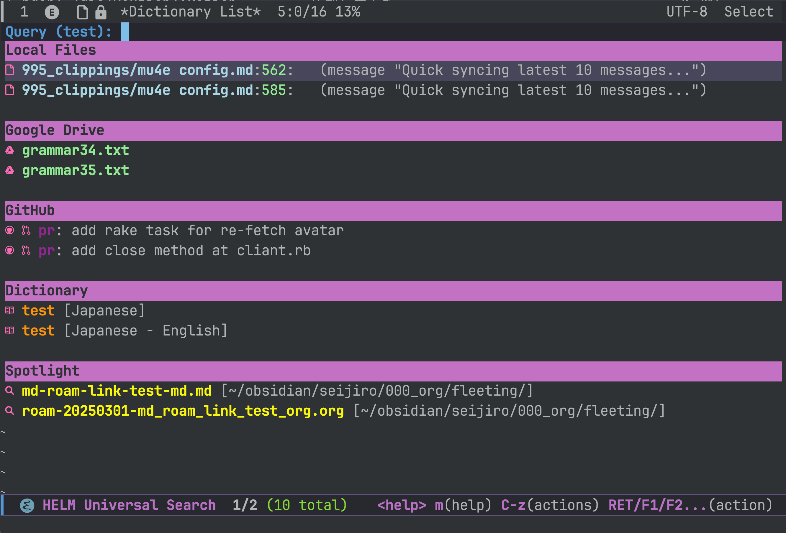

# Universal Search for Emacs

A unified search interface that allows you to search across multiple sources from within Emacs:

- **Local files** (using ripgrep)
- **Google Drive documents**
- **GitHub repositories**
- **Dictionaries** (via lookup.el)
- **macOS Spotlight** (via mdfind)

## Screenshot


## Features

- Single interface for searching across multiple sources
- Nerd Font icons for visual identification of result types
- Customizable number of results from each source
- Source-specific actions (open, copy link/path, view metadata)
- Advanced customization options to enable/disable sources

## Installation

### 1. Clone this repository:
```bash
git clone https://github.com/modeverv/universal-search ~/.emacs.d/universal-search
```

### 2. Add to your Emacs configuration:
```elisp
(add-to-list 'load-path "~/.emacs.d/universal-search")
(require 'universal-search)
```

### 3. Install Python dependencies:
```bash
cd ~/.emacs.d/universal-search/python
pip install -r requirements.txt
```

### 4. External Dependencies

- **ripgrep** (`rg`) for local file search
- **Python 3.x** for API scripts
- **Nerd Fonts** (optional, but recommended for icons)

For macOS:
- **mdfind** (built-in)

### 5. API Setup

#### Google Drive API
- Visit Google Cloud Console: https://console.cloud.google.com/
- Create a new project (or select an existing one)
- Enable the Drive API
- Create OAuth credentials for a Desktop application
- Download the credentials and save as `~/.emacs.d/universal-search/python/credentials.json`

#### GitHub API
- Go to GitHub Settings → Developer settings → Personal access tokens → Tokens (classic)
- Generate a new token with appropriate scopes (`repo` and `read:user`)
- Save the token in `~/.emacs.d/universal-search/python/config.ini`:
  ```ini
  [github]
  token = YOUR_GITHUB_PERSONAL_ACCESS_TOKEN
  ```

## Usage

- `M-x universal-search` - Start searching across all sources
- Enter your query when prompted

In the Helm interface:
- Results are grouped by source type
- `RET` (Return) to open the selected item
- `C-z` to copy the link/path to clipboard (persistent action)
- `TAB` to see available actions for each result

## Actions by Source Type

### Local Files
- Open in Emacs
- Copy path to clipboard
- Open with external application
- View file metadata

### Google Drive
- Open in browser
- Copy link to clipboard

### GitHub
- Open in browser
- Copy link to clipboard

### Dictionary
- Look up definition
- Copy text to clipboard

### Spotlight (macOS only)
- Open file in Emacs
- Copy path to clipboard
- Open with external application
- View file metadata

## Customization

You can customize this package through `M-x customize-group RET universal-search`, including:

- Enable/disable individual search sources
- Set maximum number of results per source
- Configure search patterns to exclude
- Adjust Helm interface height
- Configure Python interpreter path
- Set Spotlight search path (for macOS)

## License
            
This project is licensed under the GNU General Public License v3.0 (GPL-3.0).

